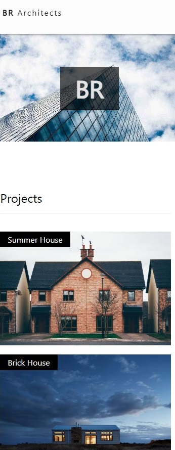
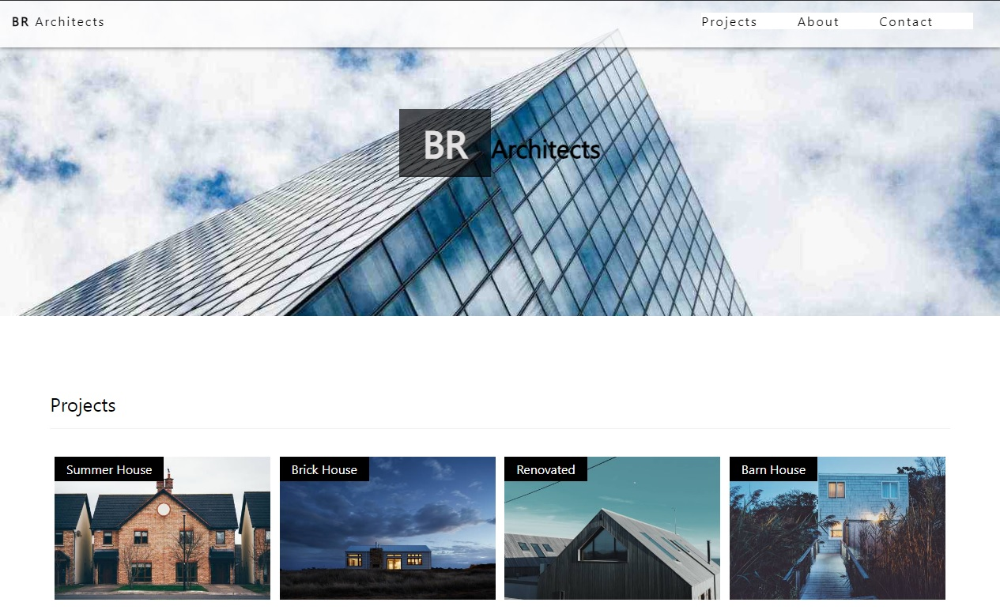

# Mockup Integration for educative project

Responsive integration of an architect's desktop mockup using HTML and CSS. Context of training 'web and mobile web developer'. 

Source : FrontEndMentor 

## Screenshots Mobile

## Screenshots Desktop

## Project Description

Mockup of a web project for an architecture firm. The project comes from FrontEndMentor and was developed independently as part of a developer training course at CEPPIC.

This is a fictional project for which it was necessary to adapt the media queries for both mobile and desktop.

## Tech Stack

**Client:** Html / CSS / Git

I used Flexbox for the placement of elements.

**Server:** None

## Contact

[Linkedin](https://www.linkedin.com/in/brian-tabart)